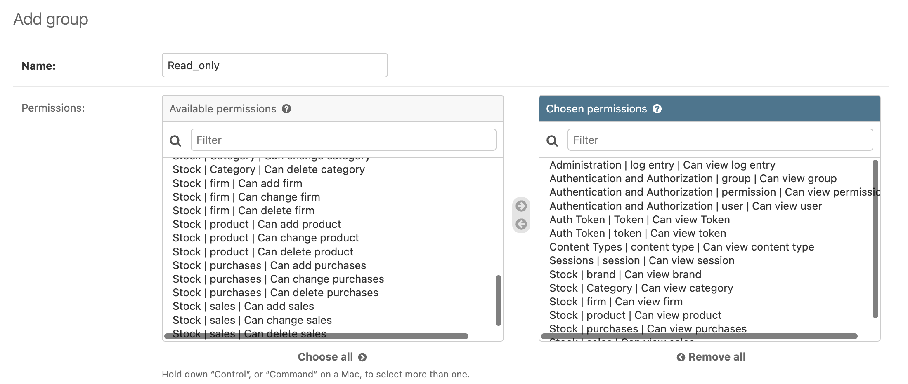

# 🦉 Endpointe Permissions Ekle

## Bu Noktadan Başla

`git checkout 226725ad0e7fba1e7d44c94a8115a8a322b762b9`

***

Admin panelden grup oluşturup kullanıcılara izinler verilebilir. Kullanıcılara izinler verebiliriz. Restframework ile bu permissionlar kullanılabiliyor.

1. **Read only group oluştur**

<figure><figcaption></figcaption></figure>

2. **Kullanıcılar oluştuğunda yani **<mark style="color:green;">**Register**</mark>** olduğunda, onları bu gruba ata**


```python
# ...
from django.contrib.auth.models import Group

@receiver(post_save, sender=User)
def create_token(sender, instance=None, created=False, **kwargs):
    if created:
        Token.objects.create(user=instance)
        user = User.objects.get(username=instance)
        if not user.is_superuser:
            group = Group.objects.get(name='Read_only')
            user.groups.add(group)
            user.save()
```


## RestFrameworkte izinler

Bir endpointte bu izinleri kontrol etmek için aşağıdaki gibi izinleri kullanabiliriz.


```python
from rest_framework.permissions import DjangoModelPermissions

class CategoryViewSet(viewsets.ModelViewSet):
    # ...
    permission_classes = [DjangoModelPermissions]
    # ...
    def get_serializer_class(self):
```


#### Normal bir kullanıcı oluştur



#### Bu kullanıcıyla post yapmayı dene

```postman_json
{
    "name": "Ai"
}
```

<figure><figcaption></figcaption></figure>
