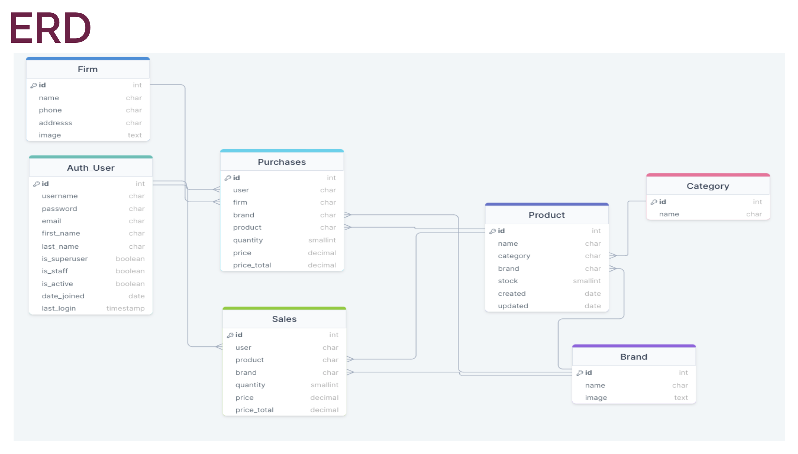

# 🗓️ Uygulama Adımları

## Repodan [başla!](yardimci-sayfalar/django-baslangic.md)

## Adım adım

1. `python manage.py startapp stock`
2. Modelleri başlat

<figure><figcaption></figcaption></figure>

### [Modelleri oluştur](uygulama-adimlari.md#modelleri-olustur)

### [Abstract class olustur](abstract-class.md)

### [Ilk endpointi oluştur](ilk-endpoint.md)
